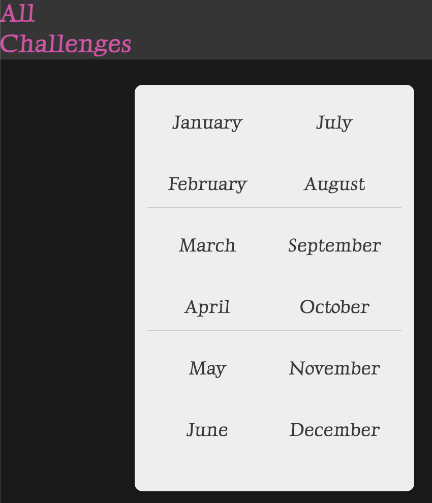

# Monthly Challenge

## Description

This project is a Django application developed as part of the Udemy course by max. The goal for me is to, 
- get familiar with Django and web dev
- start building my own blogs with it. Getting tired of mkdocs for my blog framework

## Features

- Feature 1
- Feature 2
- Feature 3

## Installation

1. Clone the repository.
2. Install the required dependencies.
3. Run the application.

## Usage

1. Step 1
2. Step 2
3. Step 3

## Contributing

Contributions are welcome! Please follow the guidelines outlined in the CONTRIBUTING.md file.

## License

This project is licensed under the MIT License. See the LICENSE.md file for more details.